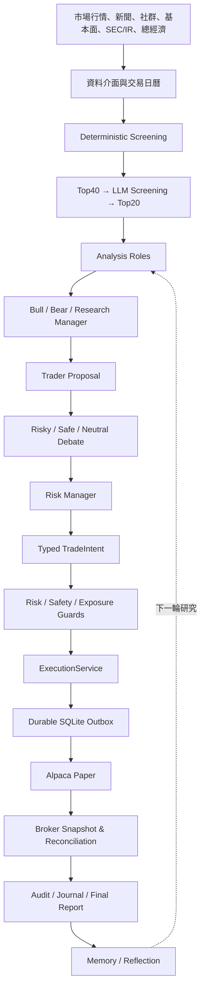

# Traders

[](https://github.com/ihsieh31/traders/actions/workflows/tests.yml)
[](https://www.python.org/)
[](LICENSE)

> **Paper-only 的多代理交易研究、風險控制與執行韌性框架。**
>
> Traders 將市場資料、研究分析師、辯論流程、結構化交易意圖、風險/安全規則、持久化執行、券商對帳與稽核記錄串成可恢復、可重播的 Python 系統。
>
> 本專案**不是投資建議、不支援實盤交易、不保證盈利，也不宣稱已證明具有持續 alpha**。所有券商寫入都必須通過 Paper-only hard lock 與 `ExecutionService` 的安全邊界。

---

## 目錄

- [項目用途](#項目用途)
- [目前狀態](#目前狀態)
- [項目目標](#項目目標)
- [系統架構](#系統架構)
- [主要功能](#主要功能)
- [安裝](#安裝)
- [設定](#設定)
- [使用方式](#使用方式)
- [輸出與資料位置](#輸出與資料位置)
- [安全與執行模型](#安全與執行模型)
- [Screening 與研究方法](#screening-與研究方法)
- [A/B 實驗設計](#ab-實驗設計)
- [驗證與證據](#驗證與證據)
- [Paper Recovery Gate](#paper-recovery-gate)
- [限制與風險](#限制與風險)
- [開發與貢獻](#開發與貢獻)
- [引用的專案與研究](#引用的專案與研究)
- [文件地圖](#文件地圖)
- [License](#license)

---

## 項目用途

Traders 的用途是**研究、驗證與記錄一套交易決策流程**，而不是讓語言模型直接下單。

它把下列工作放在同一個可稽核流程中：

1. 取得行情、新聞、社群、基本面、SEC/IR 與總經濟資料。
2. 由不同分析角色研究同一批證據。
3. 透過 Bull/Bear 研究與 Risky/Safe/Neutral 風險辯論整理方案。
4. 將結論轉成受 schema 約束的 `TradeIntent`。
5. 經過 deterministic risk、safety、market-clock、報價與曝險檢查。
6. 寫入 durable execution ledger，再透過 Alpaca Paper API 建立訂單。
7. 保存 broker snapshot、reconciliation、事件、結果與反思記錄。
8. 支援中斷後恢復、30 日曆天 observation，以及 Traders × AI-Berkshire A/B 研究。

**LLM 的輸出不是訂單。** 未通過結構化與 deterministic 檢查的內容，不會被猜測、轉換或直接送往券商。

---

## 目前狀態

狀態基準：`main` 分支，文件整理基準為 2026-09-25。

| 項目 | 狀態 | 說明 |
| --- | --- | --- |
| Python 執行環境 | ✅ | Python 3.10+；CI 驗證 Python 3.11 與 3.12 |
| Paper-only 安全邊界 | ✅ | 不接受 live endpoint 或無法證明為 Paper 的設定 |
| 多代理研究與辯論 | ✅ | 角色化 LLM、typed intent、prompt/audit 記錄 |
| 全市場 screening | ✅ | 61-session 資料完整性、Top40/Top20、cache seal、entry gate |
| Durable execution | ✅ | SQLite outbox、deterministic ID、UNKNOWN recovery、reconciliation |
| Long-run observation | ✅ | 互動設定、preflight、journal、resume、stop code、final report |
| Full-market A/B | ✅ | shared frozen evidence、兩 backend runtime、雙 Paper account 隔離 |
| 離線與 shadow 驗證 | ✅ | CI、mock、fault injection、shadow A/B 已覆蓋 |
| 真實 Alpaca Paper crash/restart recovery gate | ⏳ **PENDING** | 仍需在正常交易時段以 production path 驗證 |

### 驗證快照

2026-09-25 的 GitHub Actions 快照為 Python 3.11/3.12：

```text
1751 passed, 2 warnings, 335 subtests passed
```

這是日期化的 CI 快照，不是永久測試數字。測試通過代表目前程式契約與離線回歸通過，**不等於真實 Paper recovery、實盤安全或策略盈利已被證明**。

---

## 項目目標

### 1. 將研究與執行分層

模型負責提出研究與決策；程式負責驗證資料新鮮度、結構、帳戶狀態、風險限制與執行權限。這樣可以區分「模型不確定」與「系統可以安全停止」。

### 2. 讓每次決策可追溯

每個 observation、symbol/date pair、prompt、tool call、LLM usage、intent、order、fill、對帳與停止原因，都應有可重播的 evidence。

### 3. 以失效安全為預設

遇到資料缺漏、狀態損壞、帳戶不一致、market clock 不允許、reconciliation 不乾淨或 provider 結果無法證明時，系統應停止或拒絕新增風險，而不是猜測或默默繼續。

### 4. 研究可比較的 A/B policy

將 Traders 與 AI-Berkshire 的研究政策放在相同 frozen evidence、相同下游流程與隔離 execution state 下比較，同時承認延遲、成交時間、持倉與記憶差異對結果的影響。

### 5. 先建立工程證據，再談策略有效性

本專案優先建立可重現的資料、決策、執行與 recovery 證據；30 日 observation 是流程觀察窗口，不是長期 alpha 的統計保證。

---

## 系統架構



### 目錄責任

| 路徑 | 責任 |
| --- | --- |
| `cli/` | Typer CLI、互動設定、single long-run 與 full-market A/B 入口 |
| `tradingagents/graph/` | LangGraph 編排、節點連線、signal extraction、reflection |
| `tradingagents/agents/` | analysts、researchers、managers、trader、risk roles 與 schemas |
| `tradingagents/dataflows/` | 行情、新聞、財報、總經、SEC/IR 與資料 fallback |
| `tradingagents/screening/` | Universe、確定性因子、Top40/Top20、cache 與 entry gate |
| `tradingagents/risk/` | 部位大小、曝險、corporate actions 與風險限制 |
| `tradingagents/safety/` | kill switch、daily loss、drawdown、concentration 與 token budget |
| `tradingagents/execution/` | durable outbox、broker authority、recovery、保護單與 exit |
| `tradingagents/long_run.py` | observation lifecycle 的協調入口 |
| `tradingagents/long_run_support/` | state、config、sessions、preflight、symbols 與 reporting |
| `tradingagents/analysis_backends/berkshire/` | AI-Berkshire frozen-evidence analysis backend |
| `scripts/run_analysis_ab.py` | 單一 symbol/date 的 frozen-evidence A/B pair runner |
| `tests/` | 離線 mock、故障注入、schema 與回歸測試 |

---

## 主要功能

### 研究與多代理決策

- Market、Social、News、Fundamentals、Macro 五類研究角色。
- Bull/Bear researchers 與 Research Manager。
- Trader proposal 與 Risky、Safe、Neutral 風險辯論。
- Risk Manager 產生 strict typed `TradeIntent`。
- Analysis、Decision、Screening 可使用不同 provider、model 與 endpoint。
- 支援 OpenAI、OpenAI-compatible local endpoint、Google、Anthropic、xAI、MiniMax、DeepSeek、Qwen、GLM、OpenRouter、Ollama 與 Azure。
- 記憶、反思、prompt capture 與完整 run audit。

### 資料與 screening

- Alpaca、Finnhub、Google News、Reddit、FRED、SEC/IR 與加密資產資料介面。
- 可使用 yfinance 作為部分資料 fallback。
- 手動 watchlist 或全市場 US equity auto-screening。
- 以完整交易日、價格、成交額、報酬、波動、量能與市值做確定性 gate。
- 對 Top40 使用獨立 Screening role，輸出嚴格驗證的 Top20 schema。
- 當日 selection cache 以日期、設定 fingerprint 與 SHA-256 seal 驗證完整性。

### Durable execution 與 recovery

- SQLite durable outbox：先 commit 本地 intent/order，才可進行 broker POST。
- `decision_id` 與 deterministic `client_order_id` 支援冪等與 recovery。
- timeout、5xx 或不確定回應進入 `UNKNOWN`，先 lookup/adopt，不盲目重送。
- `BrokerSnapshot` 與 reconciliation 是帳戶與持倉的權威來源。
- 送出前重新檢查 market clock、帳戶、報價、entry policy、部位與曝險。
- 具備 account lock、global runner lock、session journal、stop code 與 terminal finalization。

### Long-run 與 A/B

- Single long-run 可設定任意正整數日曆天或 continuous observation。
- Full-market A/B 共享每日 frozen evidence，並隔離兩 backend runtime、memory、execution DB、Safety state 與 Paper account。
- 支援 crash/resume、calendar authority、daily reports 與 final report。
- 最終權益以 broker account snapshot 為權威，不以 local signal 或 DB 自行推算。

---

## 安裝

### 系統需求

- Python 3.10 或以上；建議使用 Python 3.11/3.12。
- `git`。
- 若要進行 Paper 或 A/B 執行，需要可用的 Alpaca Paper 帳戶。
- 若要使用雲端 LLM 或外部資料，需要相應 API key；也可用 OpenAI-compatible local endpoint。
- 本專案只支援 Paper 券商操作，不提供 live trading path。

### 可重現安裝（建議）

```bash
git clone https://github.com/ihsieh31/traders.git
cd traders

python -m venv .venv
source .venv/bin/activate

python -m pip install --upgrade pip
pip install --no-deps -r requirements.lock
pip check
```

Windows PowerShell 啟用虛擬環境：

```powershell
.venv\Scripts\Activate.ps1
```

`requirements.lock` 是 CI 與 Docker 使用的完整 pinned closure，**不應手動修改**。需要更新依賴時，應先修改 `requirements.txt` 或 `requirements-dev.txt`，再重新產生 lock。

### 一般開發安裝

若不需要完全重現的 dependency closure，可以使用：

```bash
pip install -r requirements.txt
pip install -r requirements-dev.txt
```

### Docker

專案提供以 Python 3.11、lock 安裝、`pip check` 與非 root user 為基礎的 [Dockerfile](Dockerfile)。容器預設 entrypoint 是：

```text
tradingagents --help
```

容器執行時仍須由外部提供正確的 Paper/LLM 設定；不要把 `.env` 或 API key 建入 image。

---

## 設定

先複製範本：

```bash
cp env.sample .env
```

`.env` 不得 commit。最小 Paper analysis/probe 設定如下：

```dotenv
TRADINGBUFFETT_ALPACA_API_KEY=your_paper_key
TRADINGBUFFETT_ALPACA_SECRET_KEY=your_paper_secret
TRADINGBUFFETT_ALPACA_USE_PAPER=True
TRADINGBUFFETT_ALPACA_READ_ONLY=True

TRADINGBUFFETT_LLM_PROVIDER=openai
TRADINGBUFFETT_OPENAI_API_KEY=your_openai_key
```

### 設定原則

- 保留 `TRADINGBUFFETT_ALPACA_READ_ONLY=True` 可進行分析與唯讀 probe。
- 只有在明確授權的 Paper observation 或 A/B Paper execution 前，才可設為 `False`。
- 不可將 live endpoint 或 `TRADINGBUFFETT_ALPACA_USE_PAPER=False` 當作備援路徑。
- 完整 API keys、role-specific keys 與 secrets 留在本機 `.env` 或安全的 secret manager。
- 不在 issue、log、screenshot 或 evidence note 中保存 credentials。

### Local / OpenAI-compatible LLM

可使用 LM Studio、Ollama、vLLM 或其他 OpenAI-compatible endpoint：

```dotenv
TRADINGBUFFETT_LLM_PROVIDER=openai
TRADINGBUFFETT_OPENAI_USE_LOCAL=true
TRADINGBUFFETT_OPENAI_BASE_URL=http://localhost:3000/v1
TRADINGBUFFETT_DEEP_THINK_LLM=your-model
TRADINGBUFFETT_QUICK_THINK_LLM=your-model
```

若 local endpoint 不支援 OpenAI web-search cloud tools，請將相關工具設為不使用 cloud search；embedding provider 不支援時，memory 會採 graceful degradation，而不是偷偷改用未驗證的模型。詳細設定見 [LOCAL_LLM_GUIDE.md](LOCAL_LLM_GUIDE.md)。

---

## 使用方式

### 單次分析

```bash
python -m cli.main --help
python -m cli.main analyze
```

`analyze` 會在終端機互動式詢問 symbol、日期、研究深度、角色模型與策略設定，並輸出研究與 execution audit 結果。

### Single long-run Paper observation

```bash
# 互動設定，預設建立 observation
python -m cli.main long-run

# 任意正整數日曆天
python -m cli.main long-run --duration-days 90

# 每完成一個 chunk 後延伸同一個 continuous observation
python -m cli.main long-run --continuous

# 選擇單一分析 backend
python -m cli.main long-run --backend traders
python -m cli.main long-run --backend berkshire
```

Long-run 流程包含：

1. 互動式收集非機密設定與 credentials。
2. 唯讀 preflight：設定、safety、role routes、LLM probe、Alpaca account、positions 與 calendar。
3. 明確 Paper authorization。
4. 依交易日曆建立 session journal。
5. 每個 session 執行 screening、研究、execution 或安全跳過。
6. 以 stop code 或 final report 結束 observation。

Long-run **不是 daemon**，不會自動安裝 OS autostart。程序中斷後，使用同一 observation state 與 CLI resume；不要刪除 execution ledger 或 active state 來「恢復」。

### 正式 full-market A/B

目前正式 full-market A/B 入口是：

```bash
python -m cli.main long-run --mode ab
```

可設定 results root、Paper notional，或使用 continuous：

```bash
python -m cli.main long-run --mode ab \
  --paper-notional-usd 500

python -m cli.main long-run --mode ab \
  --results-root ~/.tradingbuffett/long_run_ab/my-observation \
  --continuous
```

A/B 模式不接受 single-symbol campaign 的 `--symbol` 或 `--start-date`；`--duration-days` 也不適用於 full-market A/B。它以全市場 shared screening 與 symbol/date pairing 運作，預設結果父目錄為 `~/.tradingbuffett/long_run_ab`。

### Shadow A/B pair

若只想比較單一 symbol/date，且不進行 broker mutation：

```bash
python scripts/run_analysis_ab.py \
  --symbol NVDA \
  --date 2026-09-21 \
  --results-root ~/.tradingbuffett/results/ab
```

若明確要做 Paper pair execution，需要使用 A/B 專用帳戶、明確的 Paper 授權與最小 notional：

```bash
python scripts/run_analysis_ab.py \
  --symbol NVDA \
  --date 2026-09-21 \
  --results-root ~/.tradingbuffett/results/ab-paper \
  --execute-paper \
  --paper-notional-usd 500
```

### Deprecated entry points

以下舊 single-symbol campaign 腳本保留作歷史相容性，但目前會 fail closed，**不是正式操作入口**：

- `scripts/run_analysis_ab_campaign.py`
- `scripts/run_analysis_ab_campaign_auto.py`

請勿把它們的 `--symbol`、`--start-date`、`--days` 或 auto-launcher 說法當作現行 full-market A/B API。

---

## 輸出與資料位置

| 產物 | 預設位置 | 用途 |
| --- | --- | --- |
| 單次 run audit | `~/.tradingbuffett/results/<symbol>/TradingAgentsStrategy_logs/runs/` | Prompt、tool call、LLM usage、state、錯誤與 final state |
| 決策記憶 | `~/.tradingbuffett/memory/trading_memory.md` | 歷史決策與後續 outcome |
| Agent memory | `~/.tradingbuffett/memory/agent_memory/` | Reflection 與相似情況記憶 |
| Execution ledger | `~/.tradingbuffett/execution/execution.sqlite3` | Intent、order、fill、protective child 與 reconciliation |
| Long-run state | `~/.tradingbuffett/long_run/` | Config、active state、journals、snapshots 與 final report |
| Full-market A/B | `~/.tradingbuffett/long_run_ab/` | Campaign、frozen evidence、backend 與 account state |
| Screening results | `~/.tradingbuffett/results/` 或 backend isolated path | Selection、Top20 與 execution entry gate |

不要刪除 execution ledger、active state 或 journal 來處理問題；先依 audit、run ID 與 operator 流程確認狀態。

---

## 安全與執行模型

本專案使用多層防護限制風險，但任何防護都不能保證絕對安全或獲利。

- **Paper-only hard lock**：無法證明 endpoint 為 Alpaca Paper 時拒絕券商寫入。
- **Typed intent**：`TradeIntent` 必須符合 strict schema；模型自由文字不會直接成為訂單。
- **Durable outbox**：本地 ledger commit 先於外部 POST。
- **冪等身份**：`decision_id` 與 deterministic `client_order_id` 讓 recovery 可辨識同一決策。
- **UNKNOWN recovery**：不確定結果先查詢與認領，不能直接重送造成重複下單。
- **Broker authority**：fresh `BrokerSnapshot`、account binding 與 `CLEAN` reconciliation 才能增加曝險。
- **Market clock**：交易時段與 entry policy 在送出前重新檢查。
- **Locks**：account lock、global runner lock 與 mode-specific lock 防止並行競爭。
- **Risk controls**：單筆風險、名目曝險、產業/集中度、daily loss、drawdown、連續拒單與 LLM token budget。
- **Short/crypto**：SHORT 逐 observation opt-in；crypto 不允許 SHORT。
- **Fail closed**：缺資料、損壞 state、未知 provider 結果或不乾淨對帳時停止新增風險。

---

## Screening 與研究方法

Auto-screening 不是「自動買入清單」，而是決定研究資源優先序的確定性前置流程。

目前主要規則包括：

- 需要足夠且完整的 61 個交易日資料。
- 使用 SIP consolidated daily bars。
- 價格至少 US$5。
- 20 日平均成交額至少 US$20M。
- 市值門檻預設 US$300M；缺少或無效市值時 fail closed。
- 先以流動性、報酬、波動與量能等確定性因子產生 Top40。
- 再由獨立 Screening role 從 Top40 產生嚴格 Top20。
- 既有持倉即使跌出 Top20，仍可加入研究集合，以檢查企業論點是否失效。
- 當日 selection cache 會綁定日期、設定 fingerprint、資料 feed 與完整性 seal；不合法或過期時拒絕沿用。

這些規則可以降低資料與流程風險，但不能自動證明某個標的具有未來報酬。

---

## A/B 實驗設計

A/B 的控制變數是 `analysis_backend`：

- **Traders**：原生五 analyst 研究流程。
- **AI-Berkshire**：business analyst、financial analyst、industry researcher、risk assessor 與非執行式 Team Lead synthesis。

兩臂共享：

- frozen `EvidencePacket`。
- Report Context 與主要下游決策鏈。
- screening cutoff、calendar 與 observation schedule。

兩臂隔離：

- analysis backend runtime。
- memory 與 agent memory。
- cache 與 screening state。
- execution DB 與 safety state。
- broker lock 與 Paper account。

### 如何解讀 A/B

A/B 可以比較兩套完整研究政策，但不能直接宣稱是純模型能力比較：

- 兩臂依序執行，價格、延遲與成交時間可能不同。
- 各自持倉、可用額度與記憶會造成後續路徑差異。
- 兩臂都 HOLD 可能是合理結果，不等於沒有研究價值。
- 訊號一致率不等於 alpha。
- 最終 P&L 應讀取 broker account equity，並理解未調整入出金、Paper 限制與策略歸因限制。

---

## 驗證與證據

### 離線驗證

```bash
python -m compileall -q tradingagents cli scripts
python -m pytest -q
```

CI 使用 Python 3.11 與 3.12 matrix：

```bash
python -m pytest tests/ -v --tb=short
```

CI 測試使用隔離狀態、fake broker 與 fake provider，不依賴 live keys，也不應進行真實券商 mutation。

### 證據等級

| 等級 | 可以證明 | 不可以證明 |
| --- | --- | --- |
| Unit / contract | schema、函式、ID、錯誤分類、fail-closed 與狀態契約 | 真實券商或 provider 可用性 |
| Mock / fault injection | restart、recovery、重複 POST 防護、持久化與故障順序 | 物理斷電、硬體 flush 保證 |
| Shadow A/B | frozen evidence、流程隔離、零 broker mutation | 交易收益、純分析因果 |
| Paper account | Paper API、market clock、訂單與 reconciliation | 真實資金、完整滑價與市場衝擊 |
| Long-run observation | 有限 session、journal、resume 與報告覆蓋 | 長期 alpha、統計顯著性與所有市場狀態 |

### 目前真實 Paper 驗證狀態

`Real Alpaca Paper crash/restart recovery gate` 目前為 **PENDING**。在它完成前，不應把 30 日 observation 宣稱為已完成全部啟動前驗收。

---

## Paper Recovery Gate

這個 gate 必須由 operator 在正常美國交易時段、專用且沒有無關部位/訂單的 Alpaca Paper 帳戶上執行。它不是單元測試，也不是可以透過 mock 代替的步驟。

完整程序見 [docs/DOCUMENTATION.md](docs/DOCUMENTATION.md) 的 Paper recovery gate 章節。摘要如下：

1. 使用正常 `long-run` production entry point、正常 screening、正常 READY intent、正常 account binding、market clock、safety guard 與 reconciliation。
2. 在正常 READY 分支的 `broker.submit_order(...)` 返回後設 breakpoint，記錄 `decision_id`、`client_order_id`、broker order ID/status 與本地 `SUBMITTING` 狀態。
3. 從第二終端 `kill -9 <pid>`，保留 run directory 與 execution database。
4. 使用正常 CLI resume，讓 `startup_recover()` 與 reconciliation 完成。
5. 證明同一 `decision_id`/`client_order_id` 對應恰好一個 broker primary order 與一個 local primary row，沒有第二次 POST，且帳戶為 `CLEAN`。

不得：

- 強制 symbol 或 signal。
- 關閉 guardrail。
- 修改 market clock。
- 直接繞過 production path 呼叫 broker SDK。
- 刪除或重建訂單來讓 evidence 通過。

若 order、lookup、account state 或數量有任何不確定，應記錄為 `FAILED/PENDING` 並保留 durable state 給 operator reconciliation。

---

## 限制與風險

- 30 個日曆天或有限 Paper observation 不足以證明長期 alpha。
- Paper 環境不等於實盤，未完整模擬延遲、滑點、市場衝擊、股息、費用與所有成交深度。
- Screening、規則化風控與模型對話可以降低流程風險，但不能保證未來收益。
- 多代理辯論可能放大同一份資訊，而不是增加獨立證據。
- 企業品質研究與 2–10 日波段交易是不同問題；AI-Berkshire 不應被誤述為完整長期巴菲特式策略。
- Fixed outcome reflection 可能把事後資產漲跌誤當成決策因果；應分開記錄規則遵守、實現 R、最大不利/有利變動與退出原因。
- 某些舊日誌、prompt 或復現腳本屬歷史證據，不能當作現行操作指令。
- 真實 provider、Python 3.11 的完整本地依賴、長時間真實市場與所有可能輸入仍需分級驗證。

---

## 開發與貢獻

### 開發檢查

```bash
python -m compileall -q tradingagents cli scripts
python -m pytest -q
git diff --check
```

開發原則：

- 不要把 API keys、Paper credentials 或完整環境輸出寫入測試、log、issue 或 evidence。
- 不要用真實 broker mutation 作為一般測試 fixture。
- 不要直接修改 `requirements.lock`；先更新來源 manifest，再重新產生 lock。
- 不要刪除 execution ledger、active state 或 journal 來繞過 recovery。
- 新增 provider/角色/資料來源時，維持 Paper-only、typed intent 與 deterministic authority。
- 修改 screening 或 A/B 契約時，應同步更新測試、文件與 evidence 解讀。

### 主要文件

- [QUICKSTART.md](QUICKSTART.md)：精簡安裝、互動設定與疑難排解。
- [ARCHITECTURE.md](ARCHITECTURE.md)：架構、模組責任、execution authority 與 lifecycle 細節。
- [LOCAL_LLM_GUIDE.md](LOCAL_LLM_GUIDE.md)：local/OpenAI-compatible LLM 設定。
- [docs/DOCUMENTATION.md](docs/DOCUMENTATION.md)：現行投資方法評估、A/B 設計、Paper gate、歷史摘要與 provenance。
- [PROJECT_GOALS_AND_STATUS.md](PROJECT_GOALS_AND_STATUS.md)：階段歷史與驗收紀錄；其中的數字與結論是日期化歷史，不應覆蓋現行 README 與程式狀態。

---

## 引用的專案與研究

本專案保留並重新整理下列來源與概念的 provenance：

### AlpacaTradingAgent

- 專案：[huygiatrng/AlpacaTradingAgent](https://github.com/huygiatrng/AlpacaTradingAgent)
- 本專案在 Paper execution、safety、long-run observation、screening、memory 與 A/B 邊界上重構。

### TradingAgents

- 專案：[TauricResearch/TradingAgents](https://github.com/TauricResearch/TradingAgents)
- 本專案使用並改造其多代理研究與 backtest 相關概念。
- 相關研究：[arXiv:2412.20138](https://arxiv.org/abs/2412.20138)，用於 cumulative return、annualized return、Sharpe ratio、maximum drawdown 與 win rate 等指標語境。

### AI-Berkshire

- 專案：[xbtlin/ai-berkshire](https://github.com/xbtlin/ai-berkshire)
- 來源 commit：`1cc1e362378cd3fea99a4f4c3b50676bce9aa4c6`
- 改寫範圍限於 frozen-evidence 的 business analyst、financial analyst、industry researcher、risk assessor 與非執行式 Team Lead synthesis。
- 保留 business essence、moat、inversion、management quality、industry/civilization trend、valuation/margin of safety、uncertainty、missing-data discipline 與 cross-validation。
- 刻意排除 portfolio review、industry funnel、quality screen、thesis tracker、news pulse、earnings team、portfolio sizing、trade execution 與 final buy/sell recommendation，以維持 A/B 控制變數。

若後續 substantial copied code，必須保留 source、commit、license 與 attribution。第三方資料服務與 Python dependencies 依各自服務條款與授權使用。

---

## 文件地圖

```text
README.md
├── 使用者入口、目前狀態、安裝與命令
├── ARCHITECTURE.md
│   └── 模組責任、資料流與 execution authority
├── docs/DOCUMENTATION.md
│   └── 現行投資方法、A/B、Paper gate、歷史摘要與來源索引
├── QUICKSTART.md
│   └── 精簡安裝與疑難排解
├── LOCAL_LLM_GUIDE.md
│   └── Local/OpenAI-compatible provider 設定
└── PROJECT_GOALS_AND_STATUS.md
    └── 階段歷史與驗收紀錄
```

---

## License

本專案採用 [Apache License 2.0](LICENSE)。

本專案是研究與工程驗證工具。使用者應自行確認資料供應商條款、模型服務條款、Paper API 條款與所在地法律；README、程式或文件不構成投資、法律或稅務建議。
